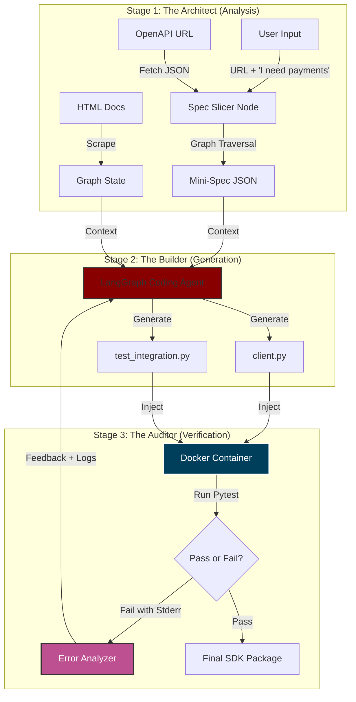

<div align="center">
   <pre>
   ▄████████  ▄█   ▄█    █▄     ▄████████     ███    
  ███    ███ ███  ███    ███   ███    ███ ▀█████████▄
  ███    ███ ███▌ ███    ███   ███    █▀     ▀███▀▀██
 ▄███▄▄▄▄██▀ ███▌ ███    ███  ▄███▄▄▄         ███   ▀
▀▀███▀▀▀▀▀   ███▌ ███    ███ ▀▀███▀▀▀         ███    
▀███████████ ███  ███    ███   ███    █▄      ███    
  ███    ███ ███  ███    ███   ███    ███     ███    
  ███    ███ █▀    ▀██████▀    ██████████    ▄████▀  
  ███    ███                                         
  </pre>
  <p text-align="center">
Generate production-ready API clients from documentation in minutes, not days.
  </p>
</div>

---


## ⚡ What is Rivet?

Rivet is not just a code generator; it is an autonomous software engineer dedicated to building Python SDKs.

Unlike standard OpenAPI generators that produce rigid, un-pythonic code, Rivet uses a multi-stage Agentic Architecture to read your Swagger/OpenAPI documentation, slice the specification to your exact needs, and generate robust, Pydantic-validated SDKs.

**The Killer Feature:** Rivet verifies its own work. It spins up a Docker container, runs pytest against the generated code, and if the tests fail, it reads the error logs and fixes the code automatically.

### 🚀 Key Features

**🎯 Context Slicing:** Don't need the whole 5,000-endpoint API? Rivet intelligently slices the OpenAPI spec to generate only the micro-SDK you requested (e.g., "Just the Payment endpoints").

**🛡️ Type-Safety First:** Generates strictly typed Pydantic v2 models for all requests and responses.

**🔄 Self-Healing Loop:** Generated code is executed in a sandbox. If pytest fails, the "Auditor" agent analyzes the stack trace and refactors the code until it passes.

**📚 Documentation RAG:** Scrapes your HTML documentation to enrich the SDK with better docstrings and edge-case handling than the raw spec provides.

### 🏗️ Architecture

Puff operates in a three-stage pipeline to ensure quality and correctness.




#### 1. The Architect (Analysis)

Rivet pulls the full OpenAPI specification. If you asked for a specific feature set, the **Spec Slicer** traverses the reference graph to isolate only the relevant endpoints and their dependent data models, creating a "Mini-Spec."

#### 2. The Builder (Generation)

A **LangGraph Coding Agent**, equipped with the Mini-Spec and RAG context from your documentation, generates the Python SDK (client.py) and a matching Test Suite (test_client.py). It adheres to strict PEP 8 and Pydantic v2 standards.

#### 3. The Auditor (Verification)

This is where the magic happens.

1. The code is injected into an isolated **Docker Container.**

2. pytest is executed.

3. **If tests pass:** The SDK is packaged and delivered to you.

4. **If tests fail:** The **Error Analyzer** captures the `stderr` output, diagnoses the crash (e.g., `ImportError`, `ValidationError`), and feeds this feedback back to the Builder Agent to attempt a fix.

### 🛠️ Installation

```
# Clone the repository
git clone https://github.com/yashghogre/Rivet.git

# Install dependencies (We use uv!)
uv sync
```


### 💻 Usage

#### 1. Run the Generator

You can generate a full SDK or scope it to specific requirements.

```
uv run rivet https://petstore.swagger.io/v2/swagger.json
```


#### 2. Output

The final package will be available in the ./output directory:

```
output/
├── client.py            # The generated SDK
└── test_client.py       # The test suite used to verify the code
```
